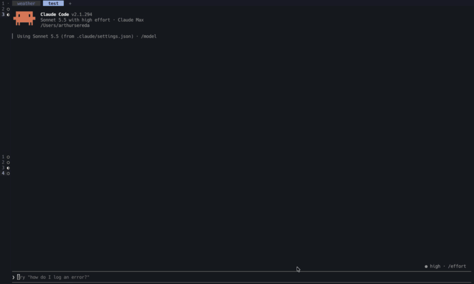

# herdr-pane-peek

A [Claude Code](https://claude.com/claude-code) mod for people who run their sessions inside herdr. Type `/pane-peek`, search the panes of **every** workspace, press Enter, and a `[herdr-id:w1E:p4]` marker for that pane lands in your prompt, so you can tell Claude exactly which pane to look at or act on.




## Install

In a Claude Code terminal session:

```
/plugin install pane-peek --marketplace arthurseredaa/herdr-pane-peek
```

Answer `y` to add the marketplace, then pick a scope (user scope makes it available in every session).

## Use

| Key | Does |
| --- | --- |
| `/pane-peek` | opens the picker; the search field has the keyboard |
| type | filters panes; every word must match the workspace, tab, cwd, agent kind, status, session title or pane id (`career claude` finds Claude sessions in a workspace called career-ops) |
| Enter in the search field | inserts the highlighted pane (the first match until you move) |
| ↑ ↓ / Tab, then Enter | pick another row and insert it |
| Esc | closes without inserting |

The pane lands in the prompt at the cursor as a marker with a trailing space: `[herdr-id:w1E:p4] `. Keep typing around it: "[herdr-id:w1E:p4] why do the tests fail there?". The marker is drawn as a chip in your theme's suggestion colors, and Backspace or Delete next to it removes the whole marker. A toast says where the pane lives (`workspace/tab · ~/path`). If the prompt cannot take text, the marker is copied to the clipboard instead.

Each row looks like `w1E:p4  my-workspace/1 · claude idle · my-project (this) — session title`; `(this)` marks the pane you are in. The list refreshes every 5 seconds while the picker is open.

## Teach Claude what the marker means

The marker is only text. Claude understands it when the official herdr skill is installed, because the skill explains herdr panes and the `herdr` CLI, and the word `herdr` in the marker is what makes Claude load it. Install it once:

```
npx skills add herdrdev/herdr --skill herdr -g -a claude-code
```

- The installer asks which agents to install to and **does not preselect Claude Code**, so pass `-a claude-code` (add `-y` to skip the confirmations). Without `-g` it installs into the current project only.
- Re-run the same command to update. If you would rather match the skill to your installed binary, `herdr --skill` prints the copy that ships with it (the copy on GitHub can be newer).
- Details: [herdr agent skill docs](https://herdr.dev/docs/agent-skill/).

Optional: `herdr integration install claude` adds a hook that lets herdr see Claude's state precisely, so the statuses in the picker are more accurate. It changes your Claude Code hooks, so it is not done for you.

## Requirements

- Claude Code started inside herdr (the `herdr` CLI on `PATH`; `HERDR_PANE_ID` is how the mod marks your own pane).
- A Claude Code build with function-hook mods enabled.

## Hacking on it

```
git clone git@github.com:arthurseredaa/herdr-pane-peek.git
cd herdr-pane-peek
claude --plugin-dir .          # load it from the folder; saving a file reloads the mod
claude plugin validate .       # manifest, marketplace and hooks
claude plugin test .           # the *.test.ts files
```

- `hooks/register.tsx`: the hooks (command, pane drawing, focus tracking, pick).
- `hooks/peek.ts`: pure helpers (`herdr api snapshot` parsing, filtering, row labels, the marker and its chip behaviour).
- `types/index.d.ts`: the `$.state` contract.
- `tsconfig.json` extends a file Claude Code writes into `.claude-plugin/types/` the first time it loads the mod, so `tsc -p .` works after one load.

## License

MIT
