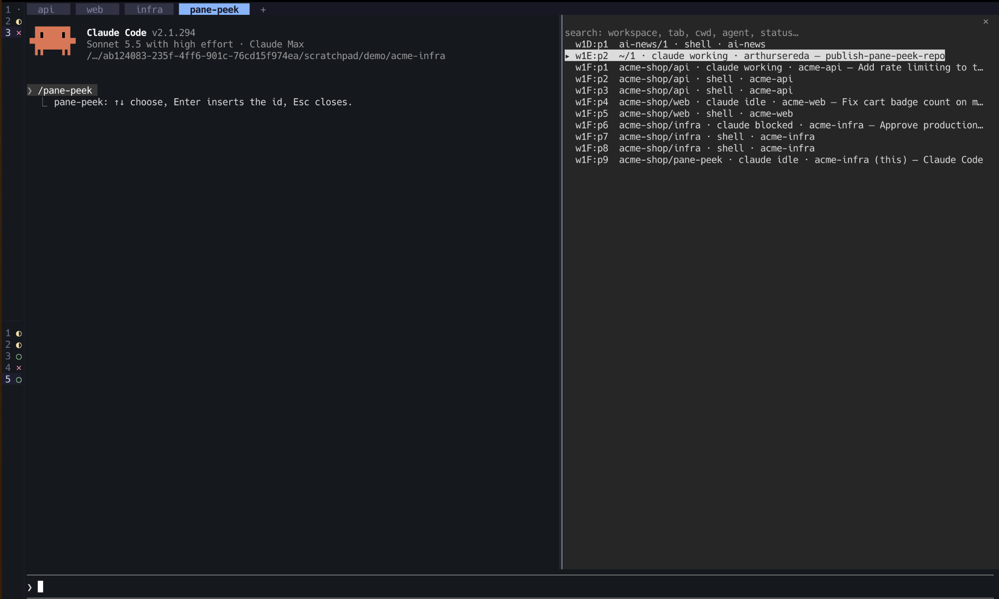

# herdr-pane-peek

A [Claude Code](https://claude.com/claude-code) mod for people who run their sessions inside herdr. Type `/pane-peek`, search the panes of **every** workspace, press Enter, and the pane id lands in your prompt, so you can tell Claude exactly which pane to look at or act on.



## Install

In a Claude Code terminal session:

```
/plugin install pane-peek --marketplace arthurseredaa/herdr-pane-peek
```

Answer `y` to add the marketplace, then pick a scope (user scope makes it available in every session).

## Use

| Key | Does |
| --- | --- |
| `/pane-peek` | opens the picker; the search field has the keyboard |
| type | filters panes; every word must match the workspace, tab, cwd, agent kind, status, session title or pane id (`career claude` finds Claude sessions in a workspace called career-ops) |
| Enter in the search field | inserts the id of the highlighted pane (the first match until you move) |
| ↑ ↓ / Tab, then Enter | pick another row and insert its id |
| Esc | closes without inserting |

The id goes into the prompt at the cursor with a trailing space (`w1E:p4 `), so you can keep typing: "look at w1E:p4 and tell me why the tests fail". If the prompt cannot take text, the id is copied to the clipboard instead.

Each row looks like `w1E:p4  my-workspace/1 · claude idle · my-project (this) — session title`; `(this)` marks the pane you are in. The list refreshes every 5 seconds while the picker is open.

## Requirements

- Claude Code started inside herdr (the `herdr` CLI on `PATH`; `HERDR_PANE_ID` is how the mod marks your own pane).
- A Claude Code build with function-hook mods enabled.

## Hacking on it

```
git clone git@github.com:arthurseredaa/herdr-pane-peek.git
cd herdr-pane-peek
claude --plugin-dir .          # load it from the folder; saving a file reloads the mod
claude plugin validate .       # manifest, marketplace and hooks
claude plugin test .           # the *.test.ts files
```

- `hooks/register.tsx`: the hooks (command, pane drawing, focus tracking, pick).
- `hooks/peek.ts`: pure helpers (`herdr api snapshot` parsing, filtering, row labels).
- `types/index.d.ts`: the `$.state` contract.
- `tsconfig.json` extends a file Claude Code writes into `.claude-plugin/types/` the first time it loads the mod, so `tsc -p .` works after one load.

## License

MIT
